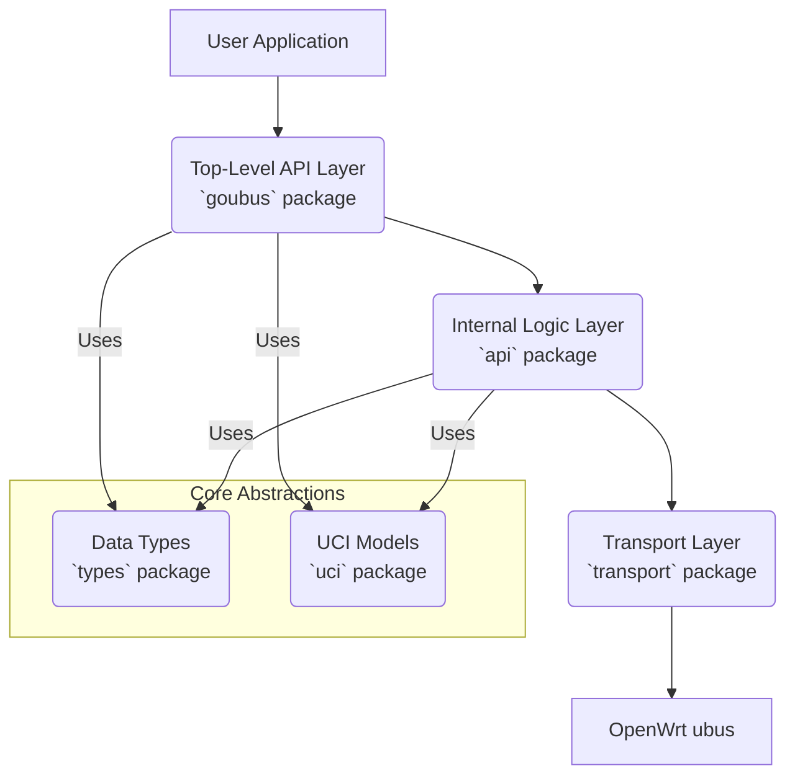

# goubus: An Elegant Go Client Library for OpenWrt ubus

[](https://golang.org/)
[](LICENSE)
[](https://goreportcard.com/report/github.com/honeybbq/goubus)

[Read this document in Chinese (中文文档)](README_CN.md)

`goubus` is a comprehensive, idiomatic Go client library for OpenWrt's ubus (micro bus) system. It provides a type-safe, elegantly designed API that allows Go developers to seamlessly integrate network management, system monitoring, and device configuration into their applications.

## Table of Contents

- [goubus: An Elegant Go Client Library for OpenWrt ubus](#goubus-an-elegant-go-client-library-for-openwrt-ubus)
  - [Table of Contents](#table-of-contents)
  - [Core Features](#core-features)
  - [Architecture Overview](#architecture-overview)
  - [Installation](#installation)
  - [Quick Start](#quick-start)
  - [API Usage Examples](#api-usage-examples)
    - [**1. System Management**](#1-system-management)
    - [**2. Network Status & Control**](#2-network-status--control)
    - [**3. UCI Configuration Management**](#3-uci-configuration-management)
      - [Fluent Chained API](#fluent-chained-api)
      - [Type-Safe Configuration Models](#type-safe-configuration-models)
      - [Example: Modifying Network Configuration](#example-modifying-network-configuration)
    - [**4. Wireless (IwInfo & Network.Wireless)**](#4-wireless-iwinfo--networkwireless)
    - [**5. DHCP Service**](#5-dhcp-service)
    - [**6. Files & Commands**](#6-files--commands)
    - [**7. Service Management (RC & Service)**](#7-service-management-rc--service)
    - [**8. Logging System**](#8-logging-system)
    - [**9. Sessions & Permissions**](#9-sessions--permissions)
    - [**10. LuCI Extension Interface**](#10-luci-extension-interface)
  - [Troubleshooting](#troubleshooting)
    - [Permission Issues](#permission-issues)
  - [Contributing](#contributing)
  - [License](#license)

## Core Features

- **Elegant Fluent API**: Features a chained-call design for an intuitive, highly readable API.
- **Complete Type Safety**: Defines clear Go structs for all ubus API requests and responses, eliminating the hassle of `map[string]interface{}`.
- **Clean, Layered Architecture**: Separates the user interface, business logic, and transport layer, making the code easy to maintain, test, and extend.
- **Powerful UCI Configuration**: Provides type-safe model binding and a fluent API to manipulate OpenWrt's UCI configuration system.
- **Comprehensive API Coverage**: Broadly supports common ubus modules like `system`, `network`, `uci`, `iwinfo`, and `service`.
- **Automatic Session Management**: Built-in authentication and session handling.
- **Robust Error Handling**: Defines detailed error types for precise exception handling.
- **Concurrency Safe**: The client can be safely used across multiple goroutines.

## Architecture Overview

`goubus` employs a clean, layered design to ensure high cohesion and low coupling:

- **Top-Level API (`goubus` package)**: The user-facing entry point, providing a concise Fluent API. It uses a "Manager-Factory" pattern, e.g., `client.System()` returns a `SystemManager`.
- **Internal Logic (`api` package)**: Encapsulates all direct interactions with the ubus RPC. It's responsible for building requests, calling the transport layer, and parsing/normalizing various complex data formats returned by ubus.
- **Transport Layer (`transport` package)**: Handles low-level HTTP/RPC communication, authentication, and session token management.
- **Data Types (`types` package)**: Defines request and response data structures for all ubus APIs, forming the core of type safety.
- **UCI Abstraction (`uci` package)**: Offers powerful serialization/deserialization tools and the `ConfigModel` interface, enabling seamless two-way mapping between Go structs and UCI configurations.
- **Utilities & Errors (`utils`, `errdefs` packages)**: Provides helper functions and unified error definitions.



## Installation

```bash
go get github.com/honeybbq/goubus
```

## Quick Start

The following example shows how to connect to an OpenWrt device and fetch system information:

```go
package main

import (
    "fmt"
    "log"
    "github.com/honeybbq/goubus"
)

func main() {
    // Create a client with authentication credentials.
    rpcClient, err := transport.NewRpcClient("192.168.1.1", "root", "password")
    if err != nil {
        log.Fatalf("Failed to connect to device: %v", err)
    }

    client := goubus.NewClient(rpcClient)

    // Get system information.
    // client.System() returns a SystemManager.
    systemInfo, err := client.System().Info()
    if err != nil {
        log.Fatalf("Failed to get system info: %v", err)
    }

    fmt.Printf("Device Model: %s\n", systemInfo.Release.BoardName)
    fmt.Printf("System Uptime: %d seconds\n", systemInfo.Uptime)
    fmt.Printf("Memory Usage: %d MB / %d MB\n",
        (systemInfo.Memory.Total-systemInfo.Memory.Free)/1024/1024,
        systemInfo.Memory.Total/1024/1024)
}
```

## API Usage Examples

`goubus` provides a dedicated "manager" for each ubus module, accessible via methods on the client, such as `client.System()`, `client.Network()`, and `client.Uci()`.

### **1. System Management**

Use `client.System()` to get the `SystemManager`.

```go
// Get hardware information
boardInfo, err := client.System().Board()

// Reboot the system
err = client.System().Reboot()
```

### **2. Network Status & Control**

Use `client.Network()` to get the `NetworkManager`. The API design mimics the hierarchical structure of `ubus`.

```go
// Get a summary of all network interfaces
dump, err := client.Network().Interfaces()
for _, iface := range dump.Interface {
    fmt.Printf("Interface: %s, Protocol: %s, Up: %t\n", iface.Interface, iface.Proto, iface.Up)
}

// Get the detailed status of the 'lan' interface.
// .Interface("lan") returns an InterfaceManager.
lanStatus, err := client.Network().Interface("lan").Status()
if err == nil && len(lanStatus.Ipv4Address) > 0 {
    fmt.Printf("LAN IP Address: %s\n", lanStatus.Ipv4Address[0].Address)
}

// Control interface state
err = client.Network().Interface("wan").Down()
// ...
err = client.Network().Interface("wan").Up()

// Reload the network service
err = client.Network().Reload()
```

### **3. UCI Configuration Management**

The UCI management in `goubus` is a core highlight. The `UciManager`, obtained via `client.Uci()`, makes complex UCI operations extremely simple and safe.

#### Fluent Chained API

You can pinpoint any configuration option with a chained call, just like accessing fields in a Go struct.

- `client.Uci()` -> `UciManager` (Entry point)
- `.Package("network")` -> `UciPackageContext` (Select config file)
- `.Section("wan")` -> `UciSectionContext` (Select section)
- `.Option("proto")` -> `UciOptionContext` (Select option)

#### Type-Safe Configuration Models

`goubus` includes built-in, type-safe models for common UCI configurations (like `network`, `wireless`, `system`). You operate on these Go structs without worrying about underlying string conversions. All models implement the `goubus.ConfigModel` interface.

#### Example: Modifying Network Configuration

```go
import "github.com/honeybbq/goubus/uci/config"

// 1. Select the 'wan' interface
wanSection := client.Uci().Package("network").Section("wan")

// 2. Create a NetworkInterface struct to hold the configuration
var wanConfig config.NetworkInterface
err := wanSection.Get(&wanConfig)
if err != nil {
    log.Fatalf("Failed to get WAN config: %v", err)
}
fmt.Printf("Original WAN protocol: %s\n", wanConfig.Proto)

// 3. Modify the configuration
wanConfig.Proto = "static"
wanConfig.IPAddr = "192.168.100.2"
wanConfig.Netmask = "255.255.255.0"
wanConfig.Gateway = "192.168.100.1"
wanConfig.DNS = []string{"8.8.8.8", "1.1.1.1"}

// 4. Write the modified struct back.
// The Set method automatically serializes the struct into UCI commands.
err = wanSection.Set(&wanConfig)
if err != nil {
    log.Fatalf("Failed to set WAN config: %v", err)
}

// 5. Commit the changes to /etc/config/network
err = client.Uci().Package("network").Commit()

// 6. Apply the changes (usually by reloading the service)
err = client.Network().Reload()
```

### **4. Wireless (IwInfo & Network.Wireless)**

Wireless operations are split into two parts:

- **`client.IwInfo()`**: For real-time wireless status, like scans and associated client lists. It corresponds to the `iwinfo` command.
- **`client.Uci().Package("wireless")`**: For reading and writing the `/etc/config/wireless` configuration file.

```go
// Get all physical wireless devices (radio0, radio1, ...)
devices, err := client.IwInfo().Devices()
if err != nil || len(devices) == 0 {
    log.Fatal("No wireless devices found")
}

// Scan using the first wireless device
scanResults, err := client.IwInfo().Scan(devices[0])
if err == nil {
    fmt.Printf("Found %d networks on %s:\n", len(scanResults), devices[0])
    for _, net := range scanResults {
        fmt.Printf("  SSID: %s, Signal: %d dBm\n", net.SSID, net.Signal)
    }
}

// Get the list of associated clients
assocList, err := client.IwInfo().AssocList(devices[0])
```

### **5. DHCP Service**

Use `client.DHCP()` to get the `DHCPManager`.

```go
// goubus currently provides an interface for adding static leases.
// Fetching the lease list is typically done via the LuCI interface or by parsing the lease file.
err := client.DHCP().AddLease(types.AddLeaseRequest{
    MAC:      "00:11:22:33:44:55",
    IP:       "192.168.1.100",
    Hostname: "my-device",
})
```

### **6. Files & Commands**

Use `client.File()` to get the `FileManager` for file operations and command execution on the device.

```go
// Execute a command
output, err := client.File().Exec("uname", []string{"-a"}, nil)

// Read file contents (returns a base64 encoded string)
fileContent, err := client.File().Read("/etc/os-release", true)

// Write to a file
err = client.File().Write("/tmp/greeting.txt", "SGVsbG8sIGdvdWJ1cyE=", true, 0644, true)

// Get file stats
stats, err := client.File().Stat("/etc/config/network")

// List a directory
files, err := client.File().List("/etc/config")
```

### **7. Service Management (RC & Service)**

- **`client.RC()`**: Corresponds to `/etc/init.d/` scripts for starting, stopping, and restarting services.
- **`client.Service()`**: `ubus`'s more powerful, built-in service manager.

```go
// Restart the network service using rc
err = client.RC().Restart("network")

// Get the status of all services
services, err := client.Service().List("", false)
for name, service := range services {
    running := false
    if len(service.Instances) > 0 {
        // Simplified check; in practice, you should iterate through instances
        running = service.Instances["instance1"].Running
    }
    fmt.Printf("Service: %-15s, Running: %t\n", name, running)
}
```

### **8. Logging System**

Use `client.Log()` to get the `LogManager` for reading from and writing to the system log (`logd`).

```go
// Read the last 50 system log entries
logs, err := client.Log().Read(50, false, true)
for _, entry := range logs.Log {
    fmt.Printf("[%s] %s: %s\n", entry.Time.Format("2006-01-02 15:04:05"), entry.Source, entry.Text)
}
```

### **9. Sessions & Permissions**

Use `client.Session()` to get the `SessionManager` for managing ubus session ACLs.

```go
// Create a session with a 300-second timeout
sessionData, err := client.Session().Create(300)

// Grant the session full access to network and uci
err = client.Session().Grant(sessionData.UbusRpcSession, "ubus", []string{"network.*", "uci.*"})
```

### **10. LuCI Extension Interface**

`client.Luci()` provides access to the LuCI RPC interface, which often returns richer, more UI-friendly data than standard `ubus` calls.

```go
// Get more detailed device information than network.interface.dump provides
devices, err := client.Luci().GetNetworkDevices()

// Get DHCP lease information
leases, err := client.Luci().GetDHCPLeases()
if err == nil {
    for _, lease := range leases.IPv4 {
        fmt.Printf("Client %s (%s) -> %s\n", lease.Hostname, lease.MAC, lease.IP)
    }
}
```

## Troubleshooting

### Permission Issues

Using `ubus` via the SSH command line typically grants full permissions. However, `goubus` accesses ubus via HTTP RPC, which is subject to OpenWrt's ACLs (Access Control Lists). If you encounter "permission denied" errors, you must configure the appropriate permissions for the user you are logging in with.

To resolve permission issues, create or modify ACL configuration files in the `/usr/share/rpcd/acl.d/` directory on your OpenWrt device.

**Note**: The default `root` user typically has full (`*`) permissions, so you can often skip this step if you are connecting as `root`.

#### **Example 1: Complete Network Management Access**

Create `/usr/share/rpcd/acl.d/network-full.json`:

```json
{
    "network-manager": {
        "description": "Full network management access",
        "read": {
            "ubus": {
                "network": ["*"],
                "network.device": ["*"],
                "network.interface": ["*"],
                "network.interface.*": ["*"],
                "network.wireless": ["*"],
                "iwinfo": ["*"]
            },
            "uci": ["*"]
        },
        "write": {
            "ubus": {
                "network": ["*"],
                "network.device": ["*"],
                "network.interface": ["*"],
                "network.interface.*": ["*"],
                "network.wireless": ["*"]
            },
            "uci": ["*"]
        }
    }
}
```

#### **Example 2: Comprehensive System Administrator Access**

Create `/usr/share/rpcd/acl.d/system-admin.json`:

```json
{
    "system-admin": {
        "description": "System administration access",
        "read": {
            "ubus": {
                "system": ["*"],
                "service": ["*"],
                "file": ["*"],
                "network": ["*"],
                "network.device": ["*"],
                "network.interface": ["*"],
                "network.interface.*": ["*"],
                "network.wireless": ["*"],
                "iwinfo": ["*"],
                "dhcp": ["*"],
                "luci-rpc": ["*"]
            },
            "uci": ["*"]
        },
        "write": {
            "ubus": {
                "system": ["*"],
                "service": ["*"],
                "file": ["*"],
                "network": ["*"],
                "network.device": ["*"],
                "network.interface": ["*"],
                "network.interface.*": ["*"],
                "rc": ["*"]
            },
            "uci": ["*"]
        }
    }
}
```

#### **Assign ACL Roles to Users**

After creating the ACL files, assign the role to a user in `/etc/config/rpcd`:

```ini
config login
    option username 'admin'
    option password '$p$admin'
    list read 'system-admin'
    list write 'system-admin'
```

#### **Apply Changes**

After modifying the configuration, restart the `rpcd` service to apply the changes:

```bash
# Restart rpcd service to apply changes
/etc/init.d/rpcd restart
```

**📖 For more details, see the [OpenWrt ubus ACLs documentation](https://openwrt.org/docs/techref/ubus#acls)**

## Contributing

We warmly welcome contributions to `goubus`! Please check out [CONTRIBUTING.md](CONTRIBUTING.md) to get started.

## License

This project is licensed under the Apache License 2.0. See the [LICENSE](LICENSE) file for details.

## Acknowledgments

### Inspiration

This project is inspired by the following projects:

- **[Kubernetes SDK](https://github.com/kubernetes/client-go)**: For its clear API design and comprehensive client library approach.
- **[moby/moby](https://github.com/moby/moby)**: For its architectural patterns and robust API structure.
- **[cdavid14/goubus](https://github.com/cdavid14/goubus)**: For foundational concepts and initial implementation ideas for ubus integration.

### Special Thanks

- The OpenWrt development team for creating the powerful ubus system.
- The Go community for its excellent tools and libraries.
- All contributors who help improve this library.

## Related Projects

- [OpenWrt](https://openwrt.org/) - The Linux distribution for embedded devices.
- [ubus](https://git.openwrt.org/project/ubus.git) - OpenWrt's micro bus architecture.
- [libubus](https://git.openwrt.org/project/libubus.git) - The C library for ubus.

---

For more information or if you need help, please feel free to open an [issue](https://github.com/honeybbq/goubus/issues).
