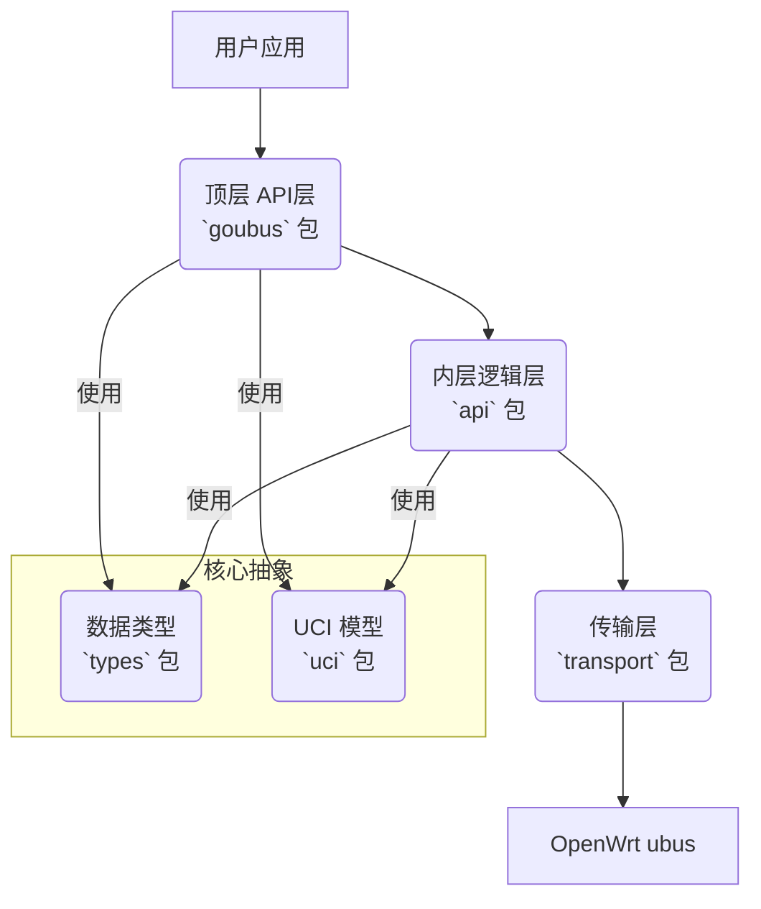

# goubus: 优雅的 OpenWrt ubus Go 语言客户端库

[](https://golang.org/)
[](LICENSE)
[](https://goreportcard.com/report/github.com/honeybbq/goubus)

`goubus` 是一个为 OpenWrt ubus（微型总线）系统设计的、功能全面且符合 Go 语言习惯的客户端库。它提供了一个类型安全、API 设计优雅的接口，让 Go 开发者可以轻松地将网络管理、系统监控和设备配置等功能集成到自己的应用中。

## 目录

- [goubus: 优雅的 OpenWrt ubus Go 语言客户端库](#goubus-优雅的-openwrt-ubus-go-语言客户端库)
  - [目录](#目录)
  - [核心特性](#核心特性)
  - [架构概览](#架构概览)
  - [安装](#安装)
  - [快速开始](#快速开始)
  - [API 使用示例](#api-使用示例)
    - [**1. 系统管理 (System)**](#1-系统管理-system)
    - [**2. 网络状态与控制 (Network)**](#2-网络状态与控制-network)
    - [**3. UCI 配置管理**](#3-uci-配置管理)
      - [流畅的链式 API](#流畅的链式-api)
      - [类型安全的配置模型](#类型安全的配置模型)
      - [示例：修改网络配置](#示例修改网络配置)
    - [**4. 无线网络 (IwInfo & Network.Wireless)**](#4-无线网络-iwinfo--networkwireless)
    - [**5. DHCP 服务**](#5-dhcp-服务)
    - [**6. 文件与命令 (File)**](#6-文件与命令-file)
    - [**7. 服务管理 (RC & Service)**](#7-服务管理-rc--service)
    - [**8. 日志系统 (Log)**](#8-日志系统-log)
    - [**9. 会话与权限 (Session)**](#9-会话与权限-session)
    - [**10. LuCI 扩展接口**](#10-luci-扩展接口)
  - [问题排查](#问题排查)
    - [权限问题](#权限问题)
  - [贡献](#贡献)
  - [许可](#许可)

## 核心特性

- **优雅的 Fluent API**：采用链式调用设计，API 直观易用，代码可读性极高。
- **完全类型安全**：为所有 ubus API 的请求和响应定义了清晰的 Go 结构体，告别繁琐的 `map[string]interface{}`。
- **清晰的分层架构**：将用户接口、业务逻辑和底层传输分离，代码易于维护、测试和扩展。
- **强大的 UCI 配置**：提供类型安全的模型绑定和流畅的 API 来操作 OpenWrt 的 UCI 配置系统。
- **全面的 API 覆盖**：广泛支持 `system`, `network`, `uci`, `iwinfo`, `service` 等常用 ubus 模块。
- **自动会话管理**：内置认证和会话管理机制。
- **健壮的错误处理**：定义了详细的错误类型，便于精确处理异常情况。
- **并发安全**：客户端可在多个 Goroutine 中安全使用。

## 架构概览

`goubus` 采用清晰的分层设计，确保了代码的高内聚和低耦合：

- **顶层 API (`goubus` 包)**：面向用户的入口，提供简洁的 Fluent API。采用“管理器-工厂方法”模式，例如 `client.System()` 会返回一个 `SystemManager`。
- **内层逻辑 (`api` 包)**：封装所有与 ubus RPC 的直接交互。负责构造请求、调用 `transport` 层、解析和规范化 ubus 返回的各种复杂数据格式。
- **传输层 (`transport` 包)**：处理底层的 HTTP/RPC 通信、认证和会话令牌管理。
- **数据类型 (`types` 包)**：定义了所有 ubus API 的请求和响应数据结构，是类型安全的核心。
- **UCI 抽象 (`uci` 包)**：提供强大的序列化/反序列化工具，以及 `ConfigModel` 接口，实现了 Go 结构体与 UCI 配置的无缝双向映射。
- **工具与错误 (`utils`, `errdefs` 包)**：提供辅助函数和统一的错误定义。



## 安装

```bash
go get github.com/honeybbq/goubus
```

## 快速开始

下面的例子展示了如何连接到 OpenWrt 设备并获取系统信息：

```go
package main

import (
    "fmt"
    "log"
    "github.com/honeybbq/goubus"
)

func main() {
    // 创建一个 rpc 客户端
    rpcClient, err := transport.NewRpcClient("192.168.1.1", "root", "password")
    if err != nil {
        log.Fatalf("无法连接到设备: %v", err)
    }
    // 使用 rpc client 创建 goubus 客户端
    client := goubus.NewClient(rpcClient)

    // 获取系统信息
    // client.System() 返回一个 SystemManager
    systemInfo, err := client.System().Info()
    if err != nil {
        log.Fatalf("无法获取系统信息: %v", err)
    }

    fmt.Printf("设备型号: %s\n", systemInfo.Release.BoardName)
    fmt.Printf("系统正常运行时间: %d 秒\n", systemInfo.Uptime)
    fmt.Printf("内存使用: %d MB / %d MB\n",
        (systemInfo.Memory.Total-systemInfo.Memory.Free)/1024/1024,
        systemInfo.Memory.Total/1024/1024)
}
```

## API 使用示例

`goubus` 为每个 ubus 模块提供了一个专属的“管理器”，通过 `client` 的方法进行访问，例如 `client.System()`、`client.Network()`、`client.Uci()`。

### **1. 系统管理 (System)**

使用 `client.System()` 获取 `SystemManager`。

```go
// 获取硬件信息
boardInfo, err := client.System().Board()

// 重启系统
err = client.System().Reboot()
```

### **2. 网络状态与控制 (Network)**

使用 `client.Network()` 获取 `NetworkManager`。API 设计模仿了 `ubus` 的层级结构。

```go
// 获取所有网络接口的摘要信息
dump, err := client.Network().Interfaces()
for _, iface := range dump.Interface {
    fmt.Printf("接口: %s, 协议: %s, 状态: %t\n", iface.Interface, iface.Proto, iface.Up)
}

// 获取 'lan' 接口的详细状态
// .Interface("lan") 返回一个 InterfaceManager
lanStatus, err := client.Network().Interface("lan").Status()
if err == nil && len(lanStatus.Ipv4Address) > 0 {
    fmt.Printf("LAN IP 地址: %s\n", lanStatus.Ipv4Address[0].Address)
}

// 控制接口状态
err = client.Network().Interface("wan").Down()
// ...
err = client.Network().Interface("wan").Up()

// 重新加载网络服务
err = client.Network().Reload()
```

### **3. UCI 配置管理**

`goubus` 的 UCI 管理功能是其核心亮点。它通过 `client.Uci()` 提供的 `UciManager`，将复杂的 UCI 操作变得极其简单和安全。

#### 流畅的链式 API

你可以像操作 Go 结构体一样，通过链式调用精确定位到任何一个配置项。

- `client.Uci()` -> `UciManager` (入口)
- `.Package("network")` -> `UciPackageContext` (选择配置文件)
- `.Section("wan")` -> `UciSectionContext` (选择配置节)
- `.Option("proto")` -> `UciOptionContext` (选择配置项)

#### 类型安全的配置模型

`goubus` 为常见的 UCI 配置（如 `network`, `wireless`, `system` 等）内置了类型安全的模型。你只需要操作这些 Go 结构体，而无需关心底层的字符串转换。所有模型都实现了 `goubus.ConfigModel` 接口。

#### 示例：修改网络配置

```go
import "github.com/honeybbq/goubus/uci/config"

// 1. 选择 'wan' 接口
wanSection := client.Uci().Package("network").Section("wan")

// 2. 创建一个 NetworkInterface 结构体来接收配置
var wanConfig config.NetworkInterface
err = wanSection.Get(&wanConfig)
if err != nil {
    log.Fatalf("获取 WAN 配置失败: %v", err)
}
fmt.Printf("原始 WAN 协议: %s\n", wanConfig.Proto)

// 3. 修改配置
wanConfig.Proto = "static"
wanConfig.IPAddr = "192.168.100.2"
wanConfig.Netmask = "255.255.255.0"
wanConfig.Gateway = "192.168.100.1"
wanConfig.DNS = []string{"8.8.8.8", "1.1.1.1"}

// 4. 将修改后的结构体写回
// Set 方法会自动将结构体序列化为 UCI 命令
err = wanSection.Set(&wanConfig)
if err != nil {
    log.Fatalf("设置 WAN 配置失败: %v", err)
}

// 5. 提交变更到 /etc/config/network
err = client.Uci().Package("network").Commit()

// 6. 应用变更 (通常通过重启服务)
err = client.Network().Reload()
```

### **4. 无线网络 (IwInfo & Network.Wireless)**

无线相关的操作分为两部分：

- **`client.IwInfo()`**：用于获取实时的无线状态，如扫描、关联客户端列表等。它对应 `iwinfo` 命令。
- **`client.Uci().Package("wireless")`**: 用于读写 `/etc/config/wireless` 配置文件。

```go
// 获取所有无线物理设备 (radio0, radio1, ...)
devices, err := client.IwInfo().Devices()
if err != nil || len(devices) == 0 {
    log.Fatal("未找到无线设备")
}

// 使用第一个无线设备进行扫描
scanResults, err := client.IwInfo().Scan(devices[0])
if err == nil {
    fmt.Printf("在 %s 上扫描到 %d 个网络:\n", devices[0], len(scanResults))
    for _, net := range scanResults {
        fmt.Printf("  SSID: %s, 信号: %d dBm\n", net.SSID, net.Signal)
    }
}

// 获取关联的客户端列表
assocList, err := client.IwInfo().AssocList(devices[0])
```

### **5. DHCP 服务**

使用 `client.DHCP()` 获取 `DHCPManager`。

```go
// 目前 goubus 提供了添加静态租约的接口
// 获取租约列表通常通过 luci 接口或解析租约文件
err := client.DHCP().AddLease(types.AddLeaseRequest{
    MAC:      "00:11:22:33:44:55",
    IP:       "192.168.1.100",
    Hostname: "my-device",
})
```

### **6. 文件与命令 (File)**

使用 `client.File()` 获取 `FileManager`，可以在设备上进行文件操作和命令执行。

```go
// 执行命令
output, err := client.File().Exec("uname", []string{"-a"}, nil)

// 读取文件内容 (返回 base64 编码的字符串)
fileContent, err := client.File().Read("/etc/os-release", true)

// 写文件
err = client.File().Write("/tmp/greeting.txt", "SGVsbG8sIGdvdWJ1cyE=", true, 0644, true)

// 获取文件状态
stats, err := client.File().Stat("/etc/config/network")

// 列出目录
files, err := client.File().List("/etc/config")
```

### **7. 服务管理 (RC & Service)**

- **`client.RC()`**: 对应 `/etc/init.d/` 脚本，用于启动、停止、重启服务。
- **`client.Service()`**: `ubus` 内置的服务管理器，功能更强大。

```go
// 使用 rc 重启网络服务
err = client.RC().Restart("network")

// 获取所有服务的状态
services, err := client.Service().List("", false)
for name, service := range services {
    running := false
    if len(service.Instances) > 0 {
        // 简化判断，实际应遍历 instances
        running = service.Instances["instance1"].Running
    }
    fmt.Printf("服务: %-15s, 运行中: %t\n", name, running)
}
```

### **8. 日志系统 (Log)**

使用 `client.Log()` 获取 `LogManager` 来读写系统日志 (`logd`)。

```go
// 读取最近 50 条系统日志
logs, err := client.Log().Read(50, false, true)
for _, entry := range logs.Log {
    fmt.Printf("[%s] %s: %s\n", entry.Time.Format("2006-01-02 15:04:05"), entry.Source, entry.Text)
}
```

### **9. 会话与权限 (Session)**

使用 `client.Session()` 获取 `SessionManager`，可以管理 ubus 会话的 ACL 权限。

```go
// 创建一个有效期为 300 秒的会话
sessionData, err := client.Session().Create(300)

// 为该会话授予对 network 和 uci 的完全访问权限
err = client.Session().Grant(sessionData.UbusRpcSession, "ubus", []string{"network.*", "uci.*"})
```

### **10. LuCI 扩展接口**

`client.Luci()` 提供了对 LuCI RPC 接口的访问，这些接口通常返回比标准 `ubus` 更丰富、更适合 UI 展示的数据。

```go
// 获取比 network.interface.dump 更详细的设备信息
devices, err := client.Luci().GetNetworkDevices()

// 获取 DHCP 租约信息
leases, err := client.Luci().GetDHCPLeases()
if err == nil {
    for _, lease := range leases.IPv4 {
        fmt.Printf("客户端 %s (%s) -> %s\n", lease.Hostname, lease.MAC, lease.IP)
    }
}
```

## 问题排查

### 权限问题

通过 SSH 命令行使用 `ubus` 通常拥有完全权限，但 `goubus` 通过 HTTP RPC 访问，会受到 OpenWrt 的 ACL（访问控制列表）限制。如果遇到“permission denied” (权限被拒绝) 的错误，您必须为登录的用户配置相应的访问权限。

要解决权限问题，请在您的 OpenWrt 设备上创建或修改位于 `/usr/share/rpcd/acl.d/` 目录下的 ACL 配置文件。

**请注意**：默认的 `root` 用户通常拥有完全 (`*`) 权限，因此如果您使用 `root` 用户连接，通常可以跳过此步骤。

#### **示例 1: 完整的网络管理权限**

创建 `/usr/share/rpcd/acl.d/network-full.json`:

```json
{
    "network-manager": {
        "description": "Full network management access",
        "read": {
            "ubus": {
                "network": ["*"],
                "network.device": ["*"],
                "network.interface": ["*"],
                "network.interface.*": ["*"],
                "network.wireless": ["*"],
                "iwinfo": ["*"]
            },
            "uci": ["*"]
        },
        "write": {
            "ubus": {
                "network": ["*"],
                "network.device": ["*"],
                "network.interface": ["*"],
                "network.interface.*": ["*"],
                "network.wireless": ["*"]
            },
            "uci": ["*"]
        }
    }
}
```

#### **示例 2: 综合的系统管理员权限**

创建 `/usr/share/rpcd/acl.d/system-admin.json`:

```json
{
    "system-admin": {
        "description": "System administration access",
        "read": {
            "ubus": {
                "system": ["*"],
                "service": ["*"],
                "file": ["*"],
                "network": ["*"],
                "network.device": ["*"],
                "network.interface": ["*"],
                "network.interface.*": ["*"],
                "network.wireless": ["*"],
                "iwinfo": ["*"],
                "dhcp": ["*"],
                "luci-rpc": ["*"]
            },
            "uci": ["*"]
        },
        "write": {
            "ubus": {
                "system": ["*"],
                "service": ["*"],
                "file": ["*"],
                "network": ["*"],
                "network.device": ["*"],
                "network.interface": ["*"],
                "network.interface.*": ["*"],
                "rc": ["*"]
            },
            "uci": ["*"]
        }
    }
}
```

#### **为用户分配 ACL 角色**

创建 ACL 文件后，在 `/etc/config/rpcd` 文件中为用户分配相应的角色：

```ini
config login
    option username 'admin'
    option password '$p$admin'
    list read 'system-admin'
    list write 'system-admin'
```

#### **应用变更**

修改配置后，重启 `rpcd` 服务以应用更改：

```bash
# 重启 rpcd 服务以应用变更
/etc/init.d/rpcd restart
```

**📖 更多详情，请参阅 [OpenWrt ubus ACLs 官方文档](https://openwrt.org/docs/techref/ubus#acls)**

## 贡献

我们非常欢迎对 `goubus` 的贡献！请查阅 [CONTRIBUTING.md](CONTRIBUTING.md) 了解如何开始。

## 许可

本项目基于 Apache License 2.0 许可。详情请见 [LICENSE](LICENSE) 文件。

## 致谢

### 灵感来源

本项目的灵感来源于以下优秀项目：

- **[Kubernetes SDK](https://github.com/kubernetes/client-go)**：其清晰的 API 设计和全面的客户端库方法。
- **[moby/moby](https://github.com/moby/moby)**：其优雅的架构模式和健壮的 API 结构。
- **[cdavid14/goubus](https://github.com/cdavid14/goubus)**：为 ubus 集成提供了基础概念和初步实现思路。

### 特别鸣谢

- OpenWrt 开发团队，创造了强大的 ubus 系统。
- Go 社区，提供了出色的工具和库。
- 所有为本库做出贡献的开发者。

## 相关项目

- [OpenWrt](https://openwrt.org/) - 专为嵌入式设备打造的 Linux 发行版。
- [ubus](https://git.openwrt.org/project/ubus.git) - OpenWrt 的微型总线架构。
- [libubus](https://git.openwrt.org/project/libubus.git) - ubus 的 C 语言库。

---

如需更多信息或帮助，请随时创建 [issue](https://github.com/honeybbq/goubus/issues)。
